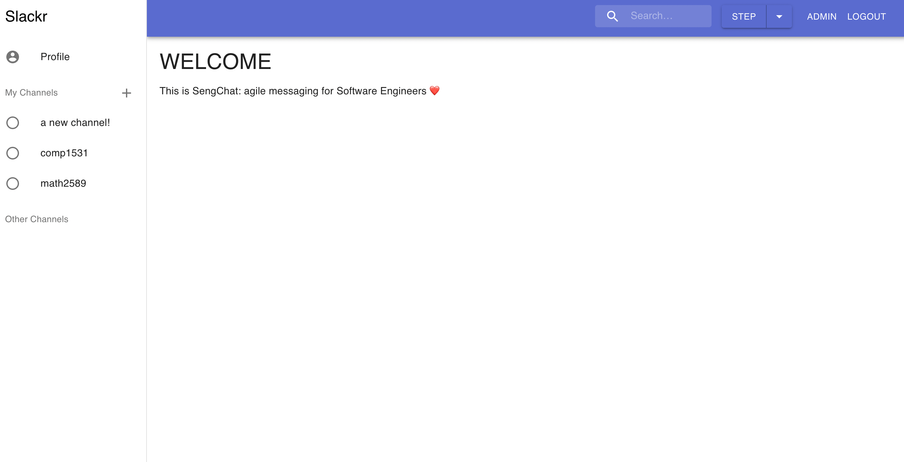
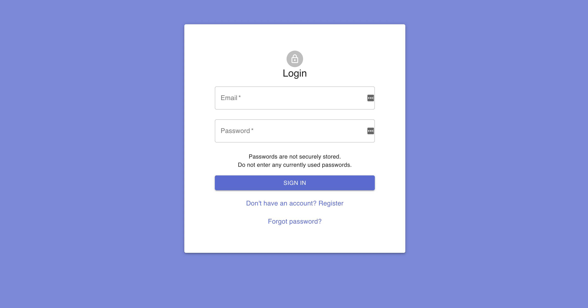

# **Slackr**
Slackr is a clone of the Slack messaging app for business', made simple for University colleagues.

<p align="center">
  
</p>

## **Getting Started**
### **Installation**
To run the frontend:
```bash
cd slackr-frontend
npm install
sh run.sh [BACKEND_PORT] [FRONTEND_PORT]
```

Ensure all python dependencies are installed before running the server using Python Poetry.

```bash
poetry install
```

To run the server:

```bash
poetry run python slackr-backend/src/server.py [BACKEND_PORT]
```
### **Usage**
Open server domain in a browser http://localhost:8080.
You will be greeted with the login page.
<p align="center">
  
</p>

Once you sign up you will need to login to go to the landing page.

Once there you will be able to make new channels, join existing ones, send messages to your colleagues and edit your profile.

## **Contact**
Peter Louka

p.louka13@gmail.com

Github => https://github.com/plouka13

LinkedIn => https://www.linkedin.com/in/peter-louka/

## **Acknowledgements**
This project was made in collaboration with:
* Mia Crittenden
* Carsen Coggeshall
